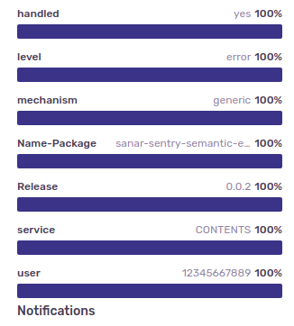
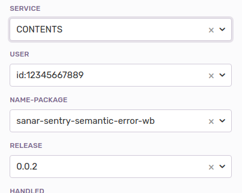
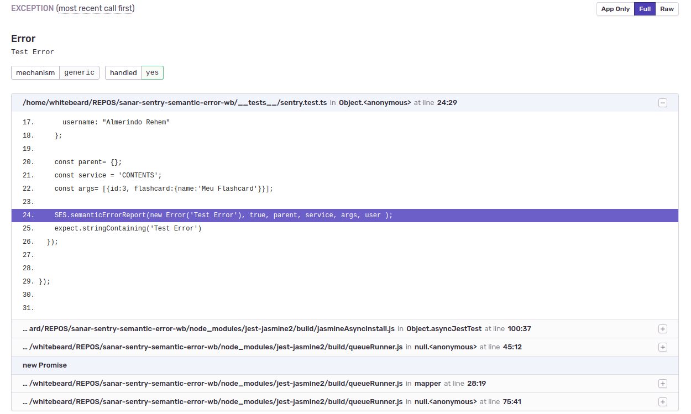
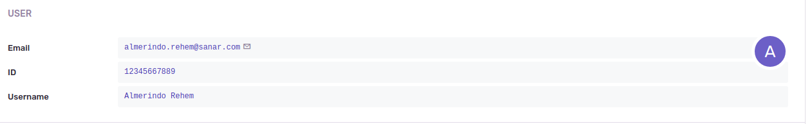
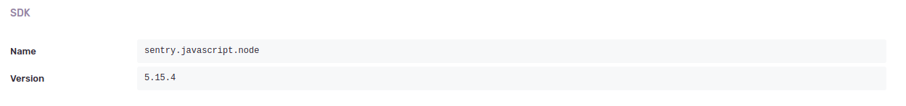
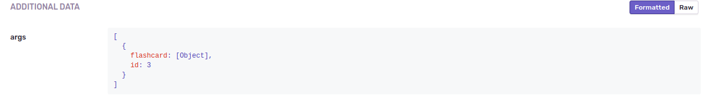

[![TypeScript version][ts-badge]][typescript-38]
[![Node.js version][nodejs-badge]][nodejs]
[![APLv2][license-badge]][LICENSE]


# semantic-sentry-error

## Getting Started

Este projeto tem como objetivo padronizar e permitir rastrear ou reproduzir os erros que são armazenadas no Sentry.

### Use as standard 

To start, just click the **[Use semantic-sentry-error][repo-template-action]** link. Now start adding your code in the `src` and unit tests in the `__tests__` directories.

### Clone repository

To clone the repository use the following commands:

```sh
git clone https://github.com/almerindo/semanic-sentry-error
cd semantic-sentry-error
yarn
```

### Download latest release

Download and unzip current `master` branch or one of tags:

```sh
wget https://github.com/almerindo/semantic-sentry-error/archive/master.zip -O semantic-sentry-error.zip
unzip semantic-sentry-error.zip && rm semantic-sentry-error.zip
```

## Available Scripts

+ `clean` - remove coverage data, Jest cache and transpiled files,
+ `build` - transpile TypeScript to ES6,
+ `build:watch` - interactive watch mode to automatically transpile source files,
+ `lint` - lint source files and tests,
+ `test` - run tests,
+ `test:watch` - interactive watch mode to automatically re-run tests

## Using

```
mkdir myfirstproject
cd myfirstproject
yarn init
yarn add semantic-sentry-error
yarn add @sentry/types 


```
Create a .env :

```
NODE_ENV=development
SENTRY_DSN=<YOUR_DSN_SENTRY>
#PATH_PACKAGE_SON=/home/PATH_OF_myfirstproject
```


```js
import { User } from '@sentry/types';
import SER from 'semantic-sentry-error';

const user :User = {
      email : "almerindo.rehem@tux4ever.com",
      id : "12345667889",
      name: "Almerindo Rehem"
    };

const parent= {BOOKMARKS:{id:123}},
const service = 'TUX SERVICE';
const args= [{id:3, arg01:{name:'Tux 4 ever'}}];

SES.semanticErrorReport(new Error('Test Error'), true, parent, service, args, user );
//or
SES.semanticErrorReport(new Error('Test Error'), false );
//or
SES.semanticErrorReport(new Error('Test Error'), true, null, service, null, user );
```
**then, look your sentry account**


### Sentry [Sentry](http://sentry.io)
**Some results in Sentry:**

**TAGS**




**Filter**



**Error**



**Scope User**


**Scope SDK**


**Scope EXTRAS**



## License
 See the [LICENSE](https://github.com/almerindo/semantic-sentry-error/blob/master/LICENSE) file for details.

[ts-badge]: https://img.shields.io/badge/TypeScript-3.8-blue.svg
[nodejs-badge]: https://img.shields.io/badge/Node.js->=%2012.16-blue.svg
[nodejs]: https://nodejs.org/dist/latest-v12.x/docs/api/
[typescript]: https://www.typescriptlang.org/
[typescript-38]: https://www.typescriptlang.org/docs/handbook/release-notes/typescript-3-8.html
[license-badge]: https://img.shields.io/badge/license-APLv2-blue.svg
[license]: https://github.com/jsynowiec/node-typescript-boilerplate/blob/master/LICENSE


[gha-badge]: https://github.com/almerindo/semantic-sentry-error/workflows/release/badge.svg


[jest]: https://facebook.github.io/jest/
[eslint]: https://github.com/eslint/eslint
[wiki-js-tests]: https://github.com/...
[prettier]: https://prettier.io
[gha-actions]: https://github.com/almerindo/semantic-sentry-error/actions/

[repo-template-action]: https://github.com/almerindo/semantic-sentry-error/
